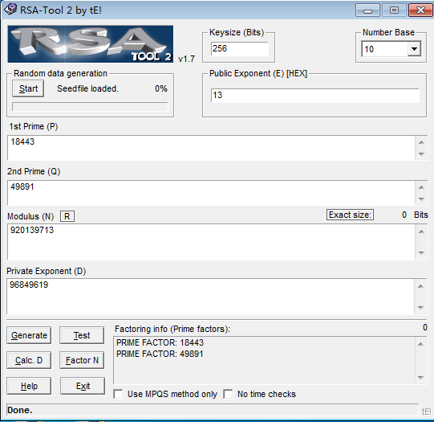

## RsaRoll (crypto, 350p)

RSA roll! roll! roll!, only number an a-z (don't use the editor which MS provide)
 
[RsaRoll.zip](./570f947da6a6a.zip)

---------------------------------------

### 思路
题目的提示是想让人去枚举爆破，但实际不需要，因为`N`很小。解压文件后，发现`data.txt`的第一行应该就是公钥`{920139713,19}`，用`RSATool`分解`N`，很快就得到`p`和`q`,再计算出`d`。



然后根据RSA加密原理：
```
m^e = c (mod N)  # 加密公式
c^d = m (mod N)  # 解密公式
```

写个脚本跑下就出来了[ans.py](./ans.py)