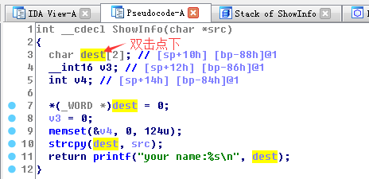

## pwn1 (pwn, 250p)

提供了以下文件：
[pwn1](./pwn1)

---------------------------------------

### 0x1 分析程序
执行下程序，再用IDA分析下，发现有个`strcpy`溢出漏洞，如果一开始的输入的name过长，再选择`1 Show the information`将导致程序溢出。查看下多少个字节溢出，在IDA的伪代码中：



```
-00000088 dest            db 2 dup(?)
-00000086 var_86          dw ?
-00000084                 db ? ; undefined
...
-00000002                 db ? ; undefined
-00000001                 db ? ; undefined
+00000000  s              db 4 dup(?)
+00000004  r              db 4 dup(?)             ; return address
+00000008 src             dd ?                    ; offset
+0000000C
+0000000C ; end of stack variables
```
可以看到140（0x88+4）个字节后将溢出覆盖返回地址。

### 0x2 构造exp
查看可以利用的plt函数
``` 
$ objdump -d -j .plt pwn1
# 下面是回显，省略了部分内容
080484a0 <puts@plt>:
 80484a0:   ff 25 1c a0 04 08       jmp    *0x804a01c
 80484a6:   68 20 00 00 00          push   $0x20
 80484ab:   e9 a0 ff ff ff          jmp    8048450 <_init+0x24>

080484b0 <system@plt>:
 80484b0:   ff 25 20 a0 04 08       jmp    *0x804a020
 80484b6:   68 28 00 00 00          push   $0x28
 80484bb:   e9 90 ff ff ff          jmp    8048450 <_init+0x24>
```

有了system函数，那再用ROPgadget找下是否有`/bin/sh`或`sh`字符串

``` 
$ ROPgadget --binary pwn1 --string "/bin/sh\0"
Strings information
============================================================

$ ROPgadget --binary pwn1 --string "sh\0"
Strings information
============================================================
0x080482ea : shs
```

发现程序里确实有`sh`字符串，那exp也出来了。详细exp内容请看[exp2.py](./exp2.py)

### 0x3 结束语
总体来说，这题还是比较简单的。但在比赛时并不知道可以直接用`system（sh）`，还以为要找到`/bin/sh`，而程序里没有找到。所以用另外的思路：看到程序要依赖`libc.so.6`，但由于服务器开启了ASLR，必须通过偏移量来得到正确的地址，这样子写出的exp比较复杂。有兴趣请看[exp.py](./exp.py)
