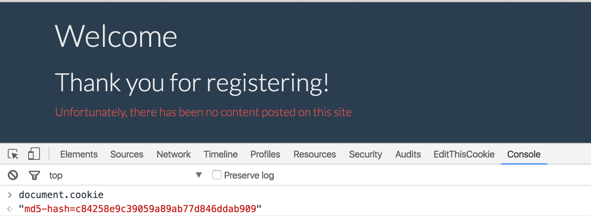

##题目描述
---

Can you hack [this](https://ernst-echidna.ctfcompetition.com/) website? The robots.txt sure looks interesting.

##题解

先看robots.txt(个人习惯..),发现有admin.提示权限不足。
注册发现admin账户已经存在，尝试注册了一个账户叫admin2，发现多了cookie
'md5-hash=c84258e9c39059a89ab77d846ddab909'

如图:

cookie是用户名admin2的md5 hash结果,遂使用document.cookie='md5-hash=21232f297a57a5a743894a0e4a801fc3', 设置新的cookie,访问admin,得到flag

> Congratulations, your token is 'CTF{renaming-a-bunch-of-levels-sure-is-annoying}'
